# 2022Winter环境配置教程(windows)

最后一次修改时间: 82023-11-14

示例操作系统: windows

# 总结

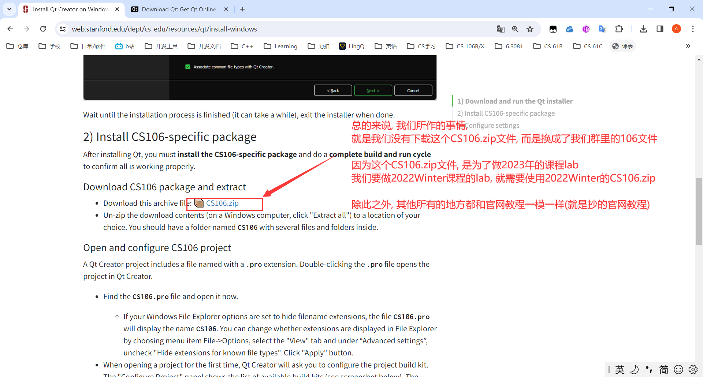

## 中文路径

我们所有的QT项目(作业lab和环境配置lab), 路径中只要出现中文名, 就会出现错误, 需要改成全英文的

咱们群文件夹里面加上了中文, 是为了大家便于区分,  但是在写lab的时候, 自己需要修改一下

# 1. 找到Qt

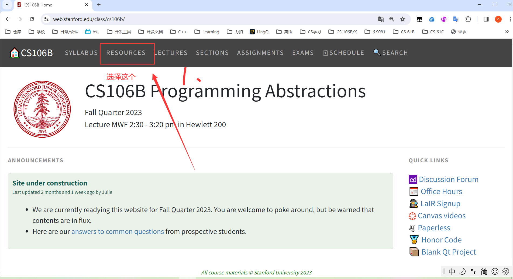

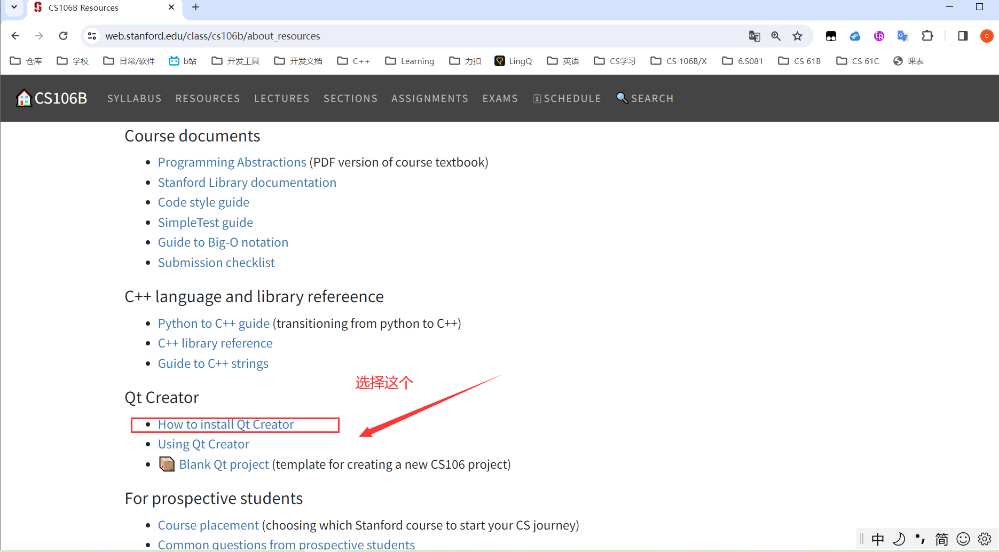

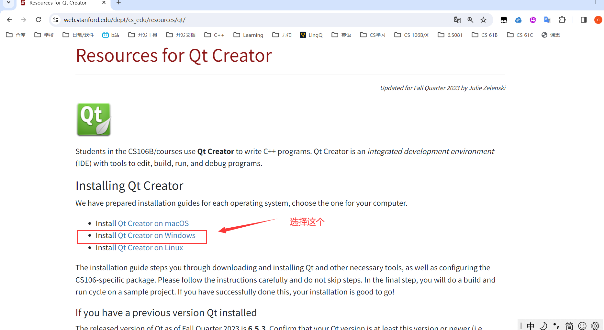

# 2. 下载Qt

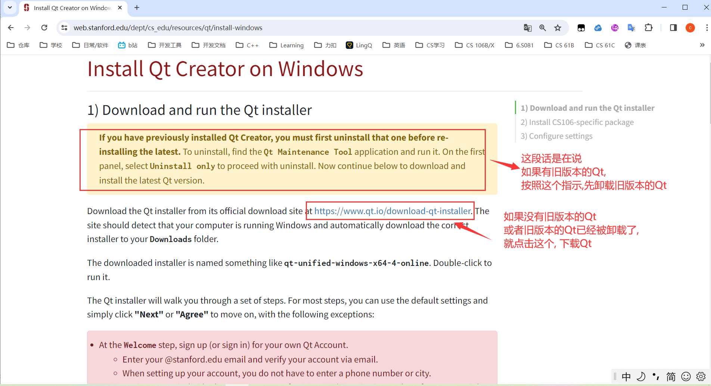

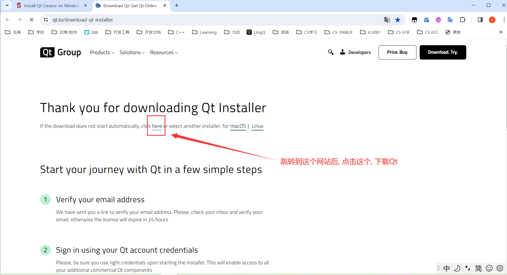

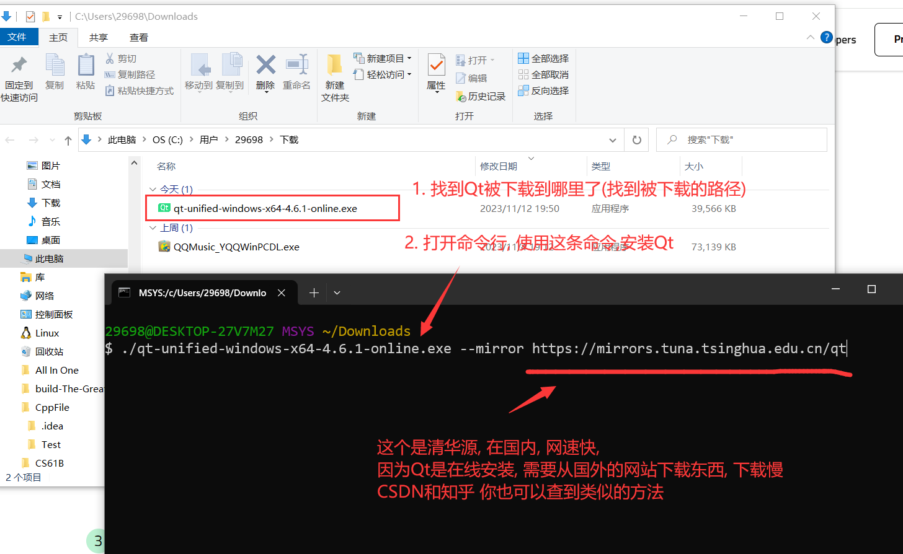

# 下载CS106项目 并编译

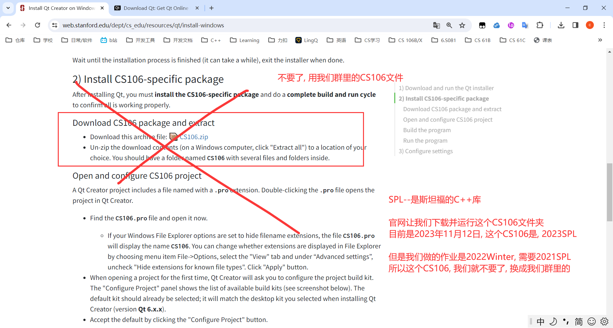

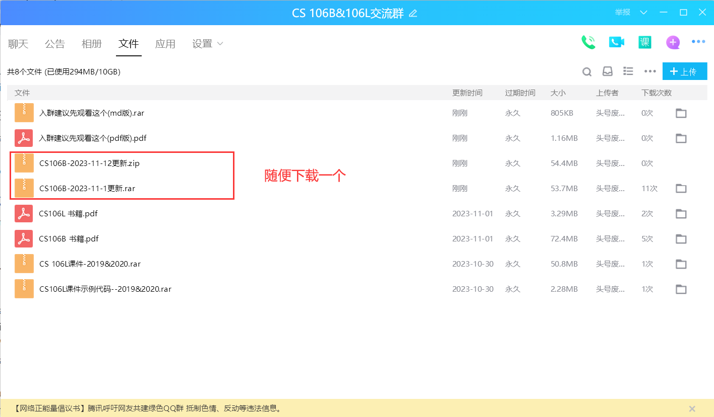

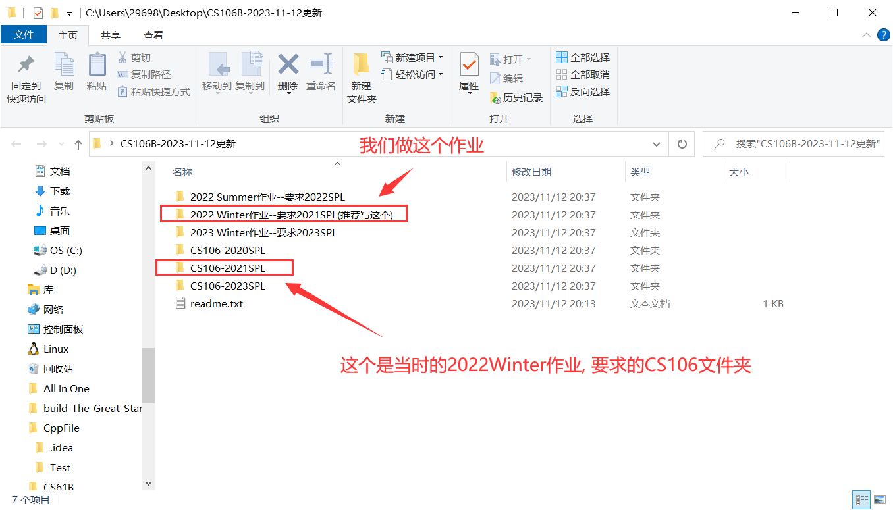

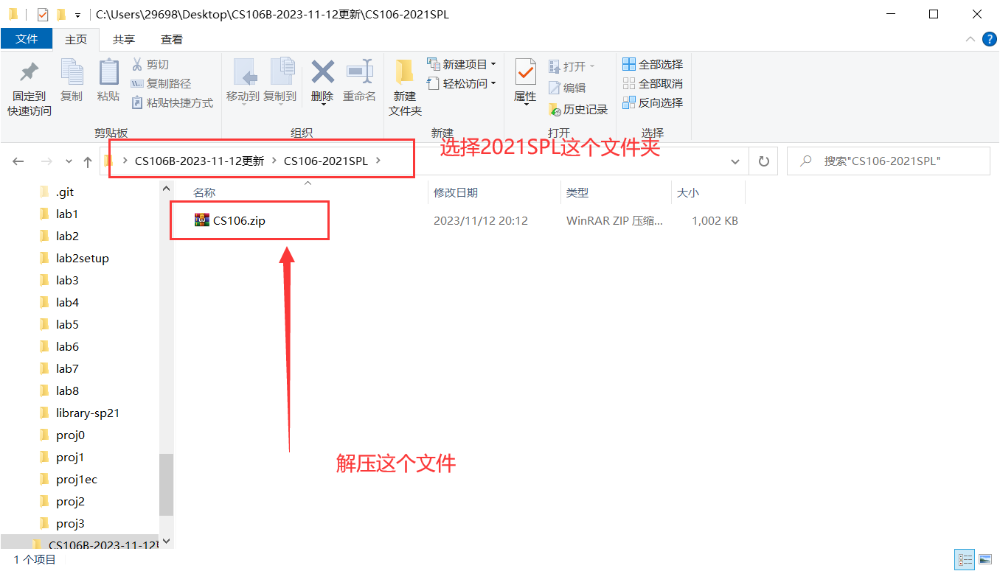

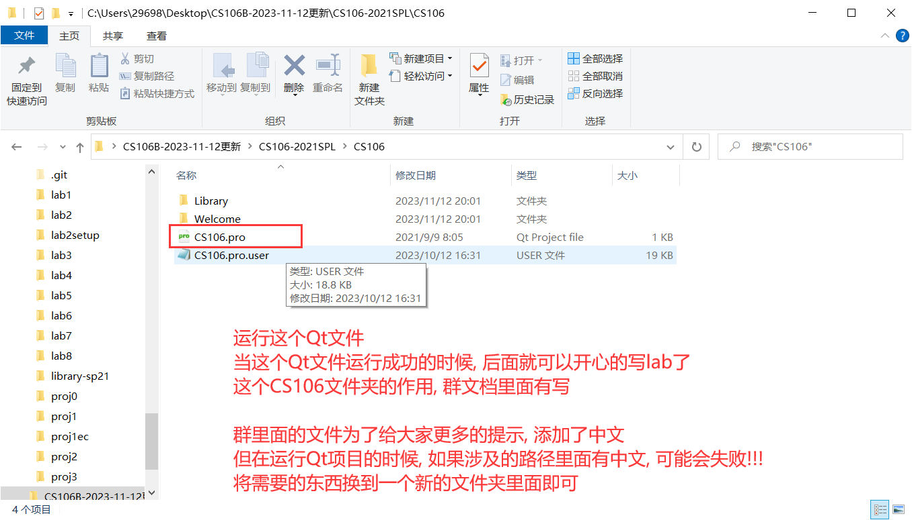