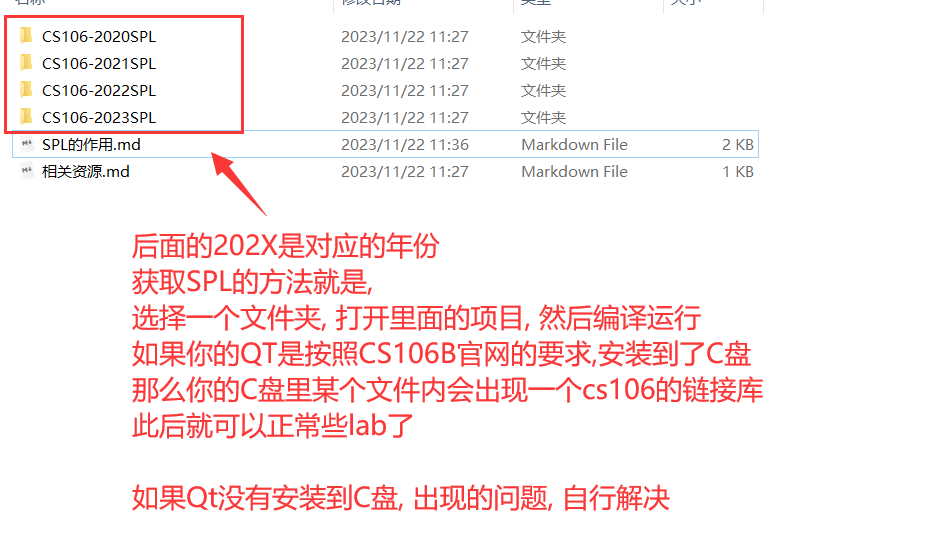

# SPL的作用

#### SPL是什么

SPL是斯坦福自己编写的一个C++库, 用来代替C++的标准库, 用于让他们的学生在初期学习数据结构和算法的时候, 只需要使用SPL, 而不需要额外学习STL, 基本上SPL就是另外一个版本的STL

#### SPL有什么作用

当我们写CS106B的作业的时候, 需要使用SPL, 而不是使用STL. (作业的启动也需要SPL的正常运转)

基本上来说, 没有SPL, 我们就无法写作业

SPL的本质就是一个链接库

#### 不同年份SPL的说明

SPL和STL一样, 他们在一直不断的更新, 2017年到2023年(至今)里面的内容已经有了很大的变化

斯坦福学生在2017年学习CS106B的时候, 基本上用的是2017SPL

斯坦福学生在2019年学习CS106B的时候, 基本上用的是2019SPL

斯坦福学生在2023年学习CS106B的时候, 基本上用的是2023SPL

可能数据有些不准确, 但是基本上是这个意思, 

也就是说, 我们在做不同年份作业的时候, 要使用不同年份的SPL

#### 如何获得SPL

