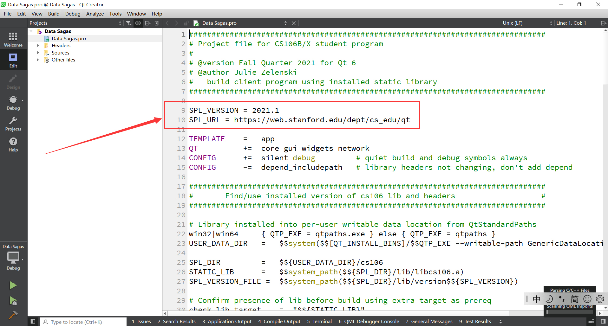
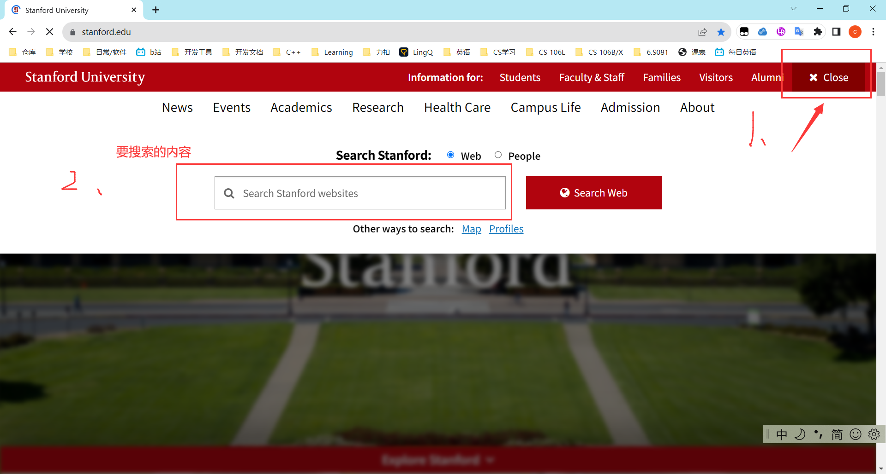

# 反馈和改进(重要)

群主写的这个文档, 群主都明白它在说些什么, 但是有的同学们不一定能看懂

所以我希望, 大家在遇到看不懂或疑惑的地方时, 可以给我一些反馈意见, 让我能够改进这个文档

你的意见和反馈, 很重要! 它们是这个文档越来越完善的基石! 

任何的意见和反馈都可以!

反馈和意见也不限于这个文档, 只要是关于CS106B&L 课程的任何内容, 都可以.

# SPL(斯坦福C++库)

CS106B/X老师的关于SPL 的仓库(需自己摸索一番): https://github.com/zelenski/stanford-cpp-library/tree/982e7169513136895baaf8f82c030a278987f840

​	2022的SPL可以通过老师的github仓库中查看历史提交记录，选择2022年的一个版本，然后下载就好了

第一个SPL文档: https://web.stanford.edu/dept/cs_edu/resources/cslib_docs/

第二个SPL文档: https://web.stanford.edu/class/archive/cs/cs106b/cs106b.1136/materials/cppdoc/

# CS 106B

#### 1. CS106文件夹的作用

在我们安装QT的时候, 最后有一个CS106项目, 
这个项目的文件夹存储了斯坦福的C++库(SPL), 其将SPL编译成一个静态链接库,并附有其版本号(存储位置在C盘)

SPL每年都在变化, 所以不同年份的lab使用的是不同年份的SPL

当你打开一个lab的.pro文件(qmake文件), **你会前10行左右**, 看到其要求的SPL版本和QT 版本
**如果使用的SPL版本错误, 小概率会出现错误**
**如果使用的QT版本错误, 大概率会出现错误-->选择符合要求的版本**

我暂时没有去看不同版本的SPL到底有什么区别, 所以说目前就只能用lab要求的SPL
SPL 2022 我还没有找到, 因此暂时不能提供

当然还有其他的解决方法, 不过我觉得这个是比较简单的方法, 其他方法暂不提供(目前群主实力不够, 等实力够了, 就能提供)

#### 2. 不同年份的lab说明

**群文件夹里面有我下载的CS106B的lab**
最新的2023 Fall 课程: lab2之后下载, 需要斯坦福学生账号密码->无解, 只能等候, 看后面lab会不会开放 

其他可下载lab的网站 (旧年份lab的QT版本问题自行google解决)

最新官网: https://web.stanford.edu/class/archive/cs/cs106b/cs106b.1242/

2023 Winter    : https://web.stanford.edu/class/archive/cs/cs106b/cs106b.1234/  

2022 Winter    : https://web.stanford.edu/class/archive/cs/cs106b/cs106b.1224/  

2022 Summer : https://web.stanford.edu/class/archive/cs/cs106b/cs106b.1228/  

#### 3. 推荐的视频

CS106B视频(GPT翻译):  https://www.bilibili.com/video/BV1Vr4y1Z7Ax/?buvid=XX2D12C202B75C5F3D43BF192941B6AD432CC&from_spmid=main.space-contribution.0.0&is_story_h5=false&mid=IMMWXqK19iP66CgCd3eehw%3D%3D&p=1&plat_id=116&share_from=ugc&share_medium=android&share_plat=android&share_session_id=104d5831-7f25-4c11-9b93-60d876537fef&share_source=QQ&share_tag=s_i&spmid=main.ugc-video-detail.0.0&timestamp=1699945508&unique_k=AlwDlln&up_id=457173750&vd_source=86c038e54178b2c8db06f72a2c1b15da

# CS106X

CS106X 2017 Autumn官网: https://web.stanford.edu/class/archive/cs/cs106x/cs106x.1182/index.shtml

CS106X 2018 Autumn官网: https://web.stanford.edu/class/archive/cs/cs106x/cs106x.1192/

CS106X 一个年份的作业: https://web.stanford.edu/class/cs106x/assignments.html

CS106X环境配置教程(来源网络, 侵权删): https://n0eb0mluamf.feishu.cn/docx/BAf1dLjTio7OfaxHzALcEHQonde  

# CS106L

##### 1. 课程视频

​	最新官网: http://web.stanford.edu/class/cs106l/

​	2019  https://www.youtube.com/playlist?list=PLCgD3ws8aVdolCexlz8f3U-RROA0s5jWA

​	2020 https://www.youtube.com/watch?v=kAnH9XLxNNo&list=PLCgD3ws8aVdqxRtKN_skFumh9fV83WEaA&index=2

##### 2. 建议的课程网站

​	https://web.stanford.edu/class/archive/cs/cs106l/cs106l.1204/lectures.html

​	这个网站能看课程的PPT, 

​	虽然106L最完整的视频是 2019, 这个网站是2020年的, 

​	但是2019和2020的授课老师是同一人, PPT制作者也是同一人, 课程PPT有70%左右的内容是重复的

-------------------------------------------------------------------------------------

# 其他事项

斯坦福很多网站经常打不开, 搜索斯坦福课程资源的方法: 斯坦福官网->右上角的Search->输入要搜索的内容

